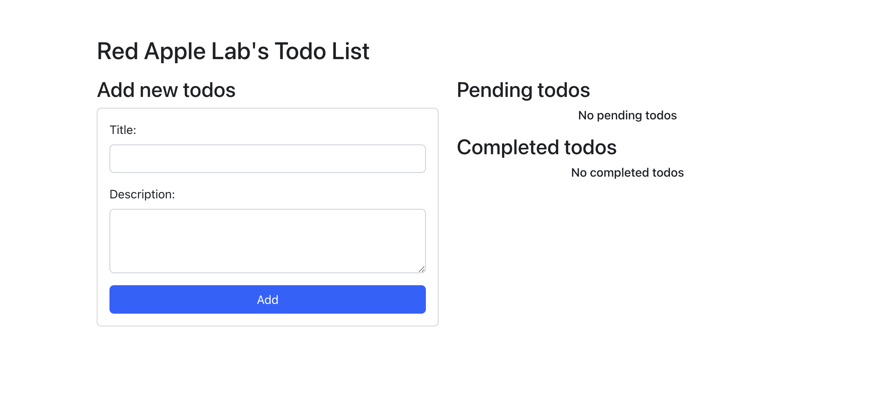
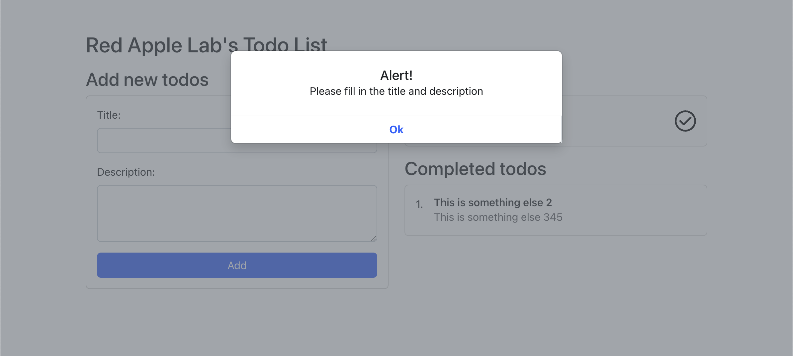
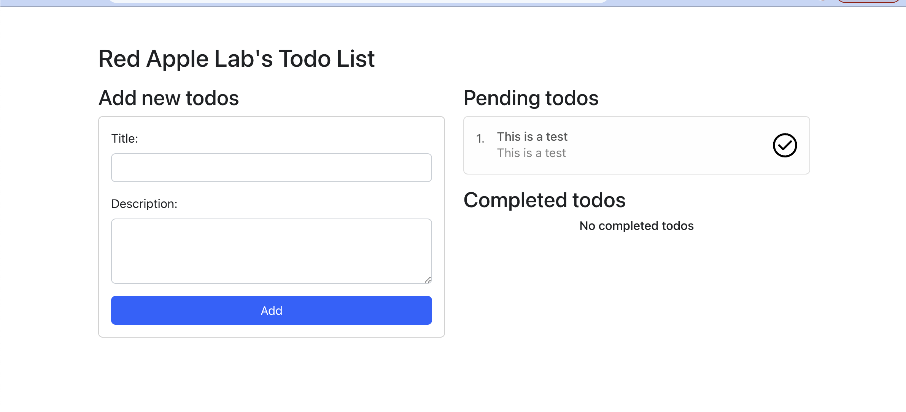
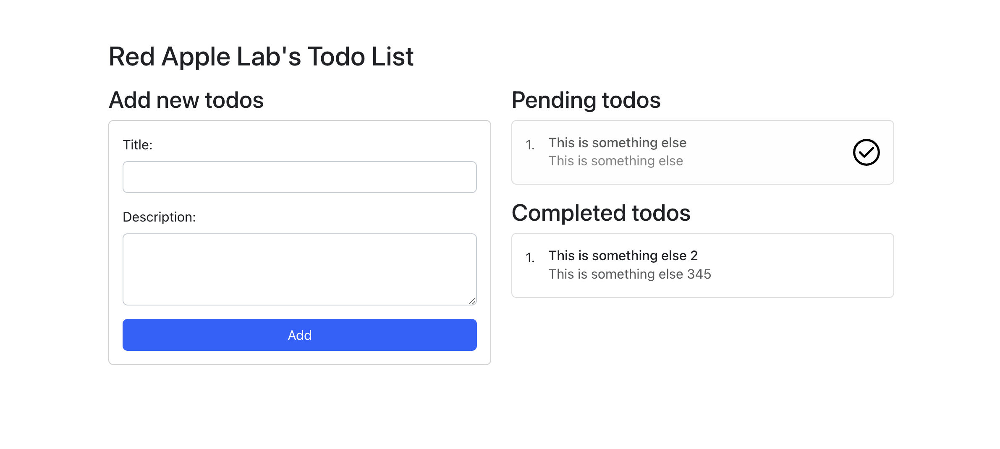
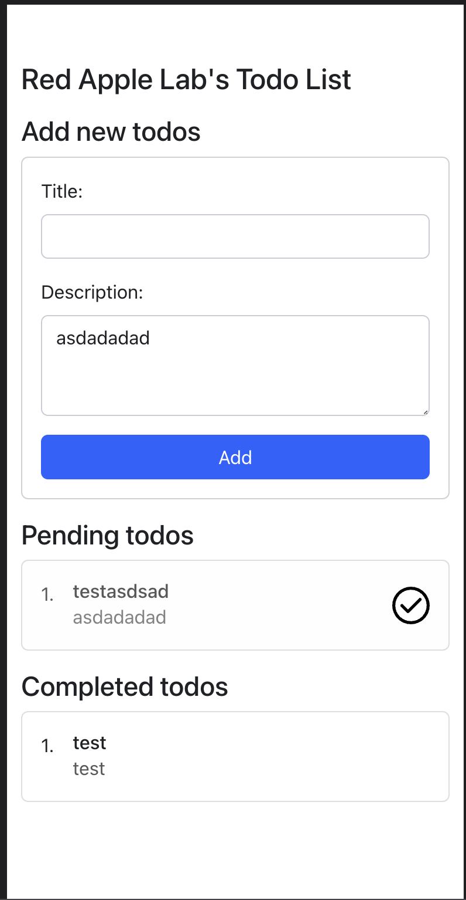

# Franklin Covey's QA Automation Engineer Challenge

## Process:
- Fork this repository.
- Complete the requirements that are explained right after this section.
- Push your changes to your forked repository.
- Send us the link to your forked repository.
- We will review your code and get back to you.
- Remember to grant access to your private repository to the following user: fc-eng-interviews

## Requirements:

### The engineering team has already completed the work, but the QA team has not had a chance to test it yet. You are the QA engineer assigned to this project. Your task is to write automated tests for this app and report any bugs you find.

#### This is the original requirement from the Product Owner:
- Create a Todo list that asks for a title, description and priority.
- The form entry items should clear/reset after the user adds a todo.
- Todo items should be added to a list of "Pending" todos section.
- When a Pending Todo is clicked, it should be moved to a "Completed" todos section.
- Some validations:
  - Title cannot be blank and cannot be less than 5 characters.
  - Description cannot be blank and cannot be less than 10 characters.
  - Cannot have todo's with the same titles.
- If any of the validations fails, it should display a Bootstrap Modal notification with the error.
- If there are no Pending Todo's / Completed Todo's, there should be a message saying "No {pending|completed} todo's".
- Only 5 Pending Todos are allowed.
- Only 10 Completed Todos are allowed.
- Page should be responsive.

#### This is the original design for the app:

### Specify which framework you picked (either Cypress or Playwright). We use Playwright, but use whatever you are comfortable with, or even both if you want.
...Playwright...

### Complete the e2e tests that are already specified in the spec files. Please comment on your code as necessary. Add any questions or comments about the provided tests here.
...Your answer goes here...

### Write an additional 3-5 automated tests you think would be useful to a test suite for this app. Please list a summary of the tests here.
...Validate Todo Page...
...Should throw a Bootstrap Alert Modal if title and description are empty...
...Should throw a Bootstrap Alert Modal if title is empty...
...Should throw a Bootstrap Alert Modal if Description is empty...
...Should be cleaned the form entry items after the user adds a todo...
...Should throw a Bootstrap Alert Modal if title has less than 5 characters...
...Should throw a Bootstrap Alert Modal if description has less than 10 characters...
...Should not allowed add ToDo with same titles...
...Should add a Pending Todo when Submit is clicked and validation passes...
...Should move the Pending Todo to Completed Todo when a todo item is pressed...
...Should be impossible to add duplicate ToDo items...
...Should be possible to add 5 Pending ToDo items...
...Should be possible to add 10 Completed ToDos...

### Explain 1-3 bugs you find, including steps to reproduce them, as if you were writing a bug ticket.

...Your answer goes here...

### This is just a space to provide any thoughts, ideas, questions, or notes that do not necessarily fit into the sections above.
...Your answer goes here...

## Available Scripts

In the project directory, you can run:

### `npm start`

Runs the app in the development mode.\
Open [http://localhost:3000](http://localhost:3000) to view it in the browser.

The page will reload if you make edits.\
You will also see any lint errors in the console.

### `npx playwright test`

Runs the end-to-end tests (Please note that this command inits the React server, add --headed at the end of the command in order to see the browser) .
Please refer to the [Playwright documentation](https://playwright.dev/docs/intro) for more information.

## Just A Reminder...

This is not intended to be a rigorous effort from you! We do not expect, or even want, a complete and thorough testing suite for this project. It is only a means for us to get a feel for your testing approach/philosophy/etc. You are welcome to email us with any questions or issues you run into.

#################
### QA Notes: ###
#################

### Install
### `playwright install`

### Run test and generate Report and screenshot
### It is possible choose any device available in `playwright.config.ts` file

### Web Chrome Run ### `npx playwright test AppTest.spec.ts --headed --project='chromium'`
### Mobile Iphone Run ### `npx playwright test AppTest.spec.ts --headed --project='Mobile Safari`

# Run with debug option to see step by step:
### `npx playwright test AppTest.spec.ts --headed --project='chromium' --debug`
### `npx playwright test AppTest.spec.ts --headed --project='Mobile Safari` --debug

# after execute the command below that will generate files equal the files that was generated in the report folder:
### `npx playwright show-report report`

### It was set report and screenshot inside the respective folders: report and test-results. For see the report run the command above.

### Bugs Found ### 
| Item   | Actual Result                                                                           | Expected Result                             |
| 01     | None alert is shown when title ('xpath=//*[@id="title"]')  has less than 05 characters  | Title field should be filled with 05 or more characters |
| 02     | None alert is shown when description xpath=//*[@id="description"] has less than 10 characters  | Description field should be filled with 10 or more characters |
| 03     | None alert is shown | After to fix the items 02 and 03 above needs to be define the alert message because documentation did not explain. |
| 04     | It was not possible to find the dialog element xpath=//*[@id="#alert-modal" | Maybe is a test issue but I will need to analyze because was not possible to inspect the item |   
| 05     | Even after appear the dialog mentioned in the bug 04 'that maybe has another id' the record was added in the pending ToDO section | Only if Title and Description were filled correctly that the record can be added in the pending ToDO section |
| 06     | The message expected "No {pending|completed} todo's" is been shown only in the complete section | The message need to be applied for both section pending and completed or needs to be update the message because currently is "No completed todos" |
| 07     | During the "Should add a Pending Todo when Submit is clicked and validation passes" test execution was verified that the description field was not filled after submission | Title and Description fields should be always cleaned  |
| 08     | As test "Should be impossible to add duplicate ToDo items" is possible to duplicate Title in Pending ToDo   | Cannot allow create Pending ToDo with same title |
| 09     | As test "Should be possible to add 5 Pending ToDo items" is possible to add only 2 Pending ToDo items but when we executed 5 times appears a dialog alert | As requirement should be possible to add 5 ToDo items |
| 10     | This last requirement "Only 10 Completed Todos are allowed." will never be happen once we can only has 3 pending ToDo added | Should be fixed the max Completed number in the requirement and the application should be prepared for this. Currently, has the bugs above in this functionality |
| 11     | All tests that failed is because the issues above, specially because the alert was not showed or the alert element was not found | Needs to apply respective alerts and needs to allows inspect this element to recover the correct id or path |

### Improvements Found ###
| Item   | Actual Result                                                           | Expected Result                             |
| 01     | 'xpath=//*[@id="root"]/div/div/div[1]/h3' is with text `Add new todos`  | All words in this title and the others title in the home page should be Titlecase, e.g, `Add New ToDos` |
| 02     | The application is responsive but the layout not friendly               | Layout, colors and styles can be improvement |
            

